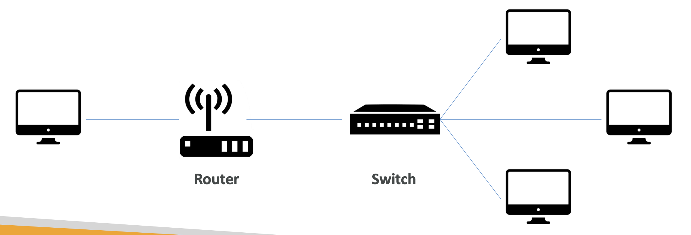
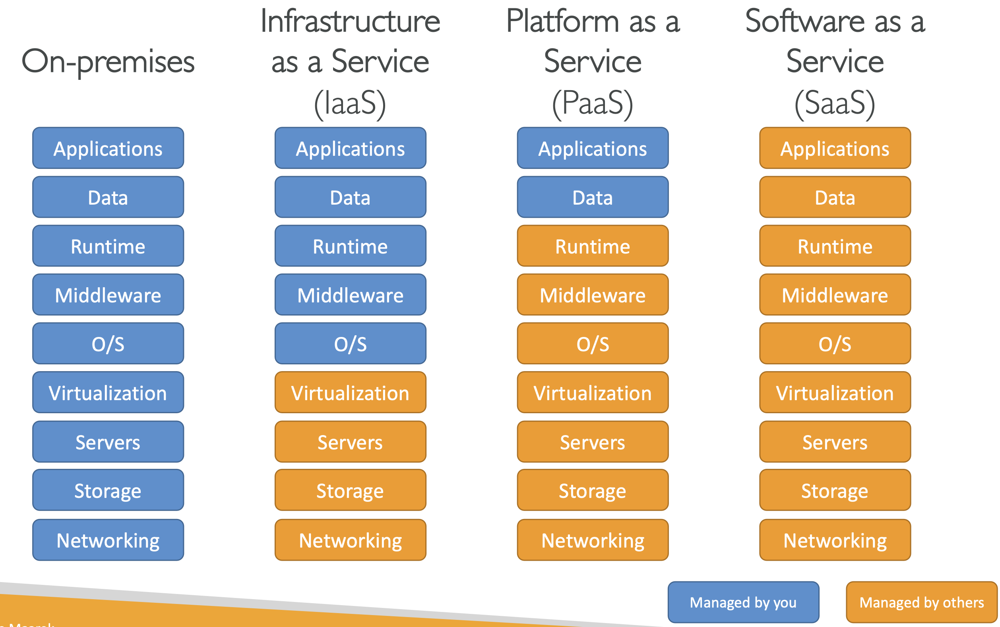
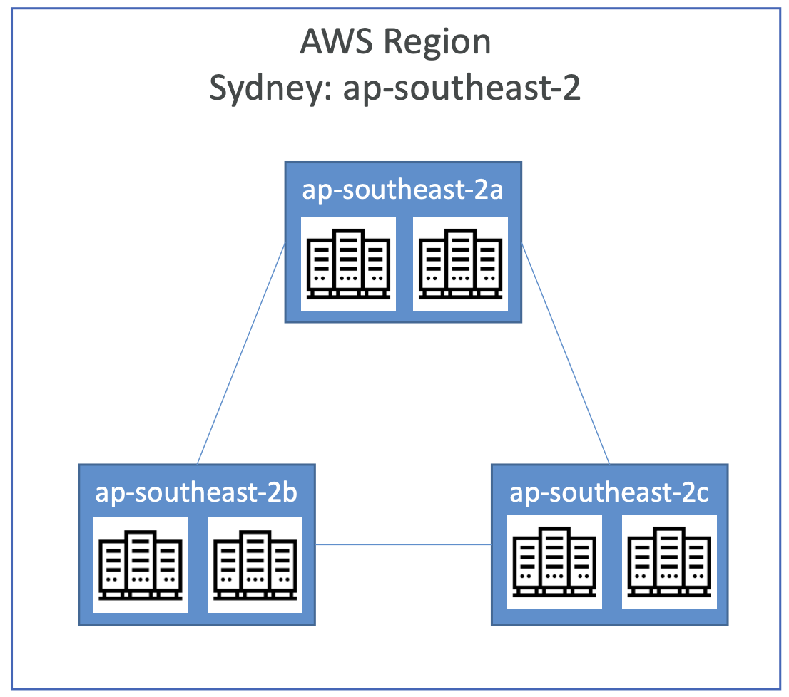
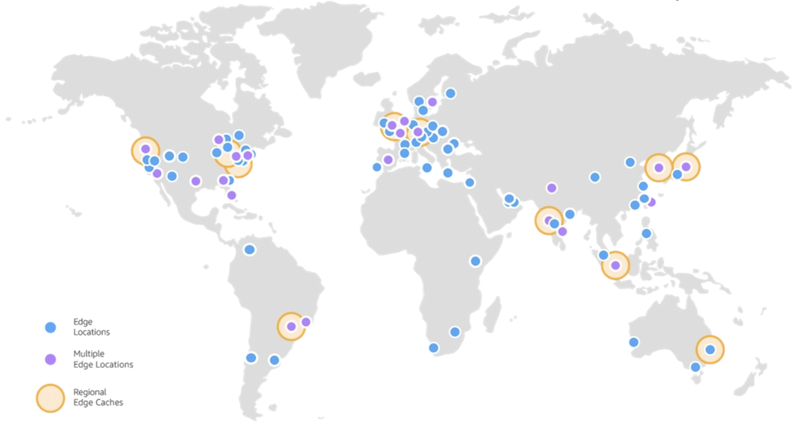
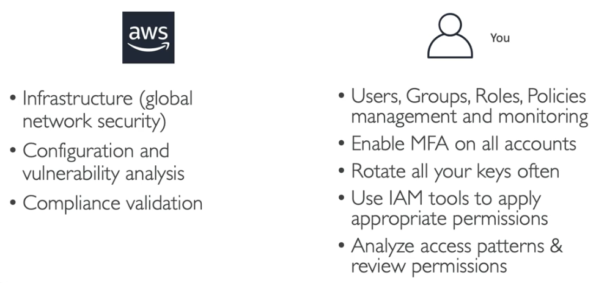

# AWS Cloud Practitioner

## Link do curso

https://www.udemy.com/course/aws-certified-cloud-practitioner-new

## Índice
<!-- TODO:  -->

# 1. Nuvem

## O que compõem um servidor (slide 13)

- CPU;
- Memória RAM;
  - CPU + Memória RAM = cérebro
- Guardar dados
- Banco de dados
- Network: Roteadores, switch, DNS



## Problemas com o padrão tradicional de servidores

- Gerenciar um datacenter físico;
- Pagar aluguel, luz e todas as despesas para manter um local físico;
- Escalar a infra é limitada;
- Contratar equipe 24/7 para monitorar;
- Desastres naturais.

## O que é computação na nuvem?

- Serviços computacionais disponíveis "On-demand";
- Paga apenas o que usar/consumir;
- Permite provisionar exatamente o tamanho e tipo de recursos que precisar;
- Acesso a quantos recursos quiser;
- "Forma simples" de acessar banco de dados, servidores e outras aplicações de infra.

## Modelos de "deployment" da nuvem

- Private cloud:
  - Usado por uma única companhia, não exposta ao público;
  - Segurança para aplicações sensíveis;
  - Regras de negócio bem específicas para a companhia em questão.

- Public cloud:
  - Recursos de nuvem mantidos por uma empresa terceira, disponibilizados na internet;
  - Ex.: AWS, Google Cloud

- Hybrid cloud:
  - Mantém alguns servidores "on premises" e extende a capacidade para a nuvem também;
  - Flexibilidade e custo da nuvem pública.

## As 5 características da computação na nuvem

- Serviços "on-demand":
  - Os clientes podem usar qualquer serviço sem depender de interação humana.

- Recursos disponíveis em qualquer parte do mundo:

- Recursos e aplicações compartilhadas
  - Múltiplos clientes compartilham a mesma infraestrutura e aplicações com segurança e privacidade;
  - Múltiplos clientes são servidos com a mesma infraestrutura física.

- Rápida elasticidade e escalabilidade:
  - Recursos podem ser adquiridos quando preciso;
  - Possibilidade de escalar os serviços quando preciso ("on-demand").

- Paga o que usar.

## 6 vantagens da computação na nuvem

- Troca de "capital expense (CAPEX)" por "operational expense (OPEX)"
  - Paga o que usa, não é dono do hardware;
  - Custos de "Total cost of ownership (TCO)" e "operational expense (OPEX)" são reduzidos.

- Benefício econômico de serviços em grande escala:
  - Preços são menores pois a AWS é mais eficiente devido a larga escala.

- Não há necessidade de adivinhar a capacidade:
  - Serviços são escalados conforme uso.

- Agilidade e velocidade aumentados

- Não há necessidade de manter datacenter físico

- Disponibilidade global em poucos minutos

## Problemas resolvidos pela nuvem

- Flexibilidade: 
  - Permite alterar tipos de recursos conforme necessidade.

- Custo "justo":
  - Paga o que consumir.

- Escalabilidade

- Elasticidade:
  - Habilidade de escalar para qualquer "lado" quando preciso.

- Alta disponibilidade dos serviços

- Agilidade:
  - Possibilita desenvolver, testar e lançar aplicações rapidamente.

## Tipos de computação na nuvem

- Infrastructure as a Service (IaaS):
  <!-- TODO: explicar melhor -->
  - Ex: EC2, Azure, Digital Ocean

- Platform as a Service (PaaS):
  - Remove a necessidade de lidar com infra de baixo nível;
  - Foco no deploy e gerenciamento da aplicação;
  - Lida com dados e aplicação.
  - Ex: Elastic beanstalk, Heroku, Windows Azure

- Software as a Service (SaaS):
  - Produto completamente gerenciado pelo provedor do serviço.
  - GMail, Dropbox, Zoom



## Precificação

A precificação da AWS possui 3 fundamentos:

- Processamento:
  - Paga por tempo de processamento.

- Armazenamento:
  - Paga por quantidade de dados armazenados na nuvem.

- Dados transferidos para FORA da nuvem:
  - Dados transferidos dentro, são grátis.

## Regiões da AWS

- Uma região possui um "cluster" de data centers no mundo todo;
- Alguns serviços da AWS só estão disponíveis em regiões específicas;

## Como escolher a região certa?

- Compliance:
  - Questões e regras legais do governo de cada região.

- Proximidade:
  - Proximidade dos usuários, reduz a latência.

- Disponibilidade de serviços:
  - Algumas regiões não possuem todos os serviços.

- Precificação:
  - Preço dos serviços pode variar entre as regiões.

## Availability Zones (AZ)

- Cada região possui algumas AZ. Mínimo 3, máximo 4;

- Cada AZ possui um ou mais data center físico;

- Cada AZ é separada uma da outra, para evitar desastres;

- Elas são conectadas umas com as outras e possuem latência muito baixa



## Pontos de presença (Edge locations)



## Diagrama do modelo de responsabilidade compartilhada

- Informação completa no site:
  - https://aws.amazon.com/compliance/shared-responsibility-model/

## Política de uso

- Proibido:
  - Uso de conteúdo ofensivo e ilegal;
  - Violações de segurança;
  - Abuso na rede;
  - Abuso no envio de emails e outras mensagens.

# 2. IAM - Identity and Access Management

## Intro

- Usuários da organização podem ser divididos em grupos;
- Grupos só contém usuários, não outros grupos;
- Usuários podem participar de vários grupos;
- Boa prática: utilizar o princípio "least privilege principle" para as permissões aos usuários:
  - Não dar mais permissões de que um usuário precisa.

## Root user

- Root User é criado por padrão e não deve ser usado ou compartilhado;
- Criar um IAM user e colocá-lo em um grupo de Admin, que vai ter os mesmos privilégios do Root e sempre usar ela ao invés do Root;

## MFA - Multi Factor Authentication

- É (muito) recomendado que todos os IAM users tenham autenticação MFA;
  - Usuários tem acessos aos recursos da AWS e tudo mais, portanto é muito problemático se alguém tiver a conta hackeada.
- MFA = senha que você conhece + token gerado por device físico;
- Opções de MFA devices:
  - Virtual MFA devices:
    - Google autheticator (Somente celular);
    - Authy (celular e PC).
  - Universal 2nd Factor Security key:
    - Hardware token

## Quais são as opções de acesso a AWS?

- Console da AWS pelo navegador: senha + MFA code para acessar;
- CLI: chaves de acesso;
- SDK: chaves de acesso.

## Comando para configurar AWS cli

```zsh
aws configure
```

Usar as chaves de acesso para configurar o ambiente do CLI

## Comando para listar usuários do IAM

```zsh
aws iam list-users
```

## Alternativa ao CLI no terminal

- Usar o próprio cloudshell da aws:
  - https://us-east-1.console.aws.amazon.com/cloudshell/home?region=us-east-1#5584bdee-f7aa-4dd5-b2e5-6a2363099507
- Está disponível apenas em [algumas regiões](https://docs.aws.amazon.com/cloudshell/latest/userguide/faq-list.html#regions-available), portanto é necessário mudar para a região correta.

## IAM roles para serviços internos da AWS

- Alguns serviços precisam fazer algumas ações dentro da própria AWS:
  - Exemplo: uma instância EC2.
- Para que essas ações sejam possíveis, é preciso setar IAM roles para EC2

## IAM security tools

- IAM Credentials report (account-level):
  - Um relatório que lista todas as contas dos usuários e seus respectivos status e credenciais;
  - Acessar o relatório no menu "Credential report" dentro do serviço IAM.

- IAM Access Advisor (user-level):
  - Mostra as permissões de serviços que foi dada a um usuário;
  - Essa informação pode ser usada para ver se o usuário está de fato usando todas as permissões que lhe foram dadas. Se ele não estiver usando, faz sentido rever as policies dele;
  - Pode ser acessado em uma aba dentro de um usuário específico, na tab "Access Advisor".

## IAM melhores práticas

- Nunca use sua conta Root, exceto para criação de uma outra conta normal;
- Um usuário físico = uma conta de usuário AWS:
  - Não compartilhar contas, sempre criar uma nova no IAM.
- Utilizar grupos e permissões para grupos;
- Senha forte e MFA;
- Criar roles para dar permissões aos serviços da AWS;
- Criar access keys para CLI/SDK;
- Usar o relatório "Credentials report" para auditar as permissões dos usuários;
- Nunca compartilhar usuários IAM e Access keys.

## Responsabilidade compartilhada

- Em resumo, a AWS é responsável por toda infraestrutura e você é responsavel de como usar essa infraestrutura.



# 3. EC2 - Elastic Compute Cloud

- Infrastructure as a Service;
- Sistemas operacionais disponíveis: Linux, Win, Mac OS;
